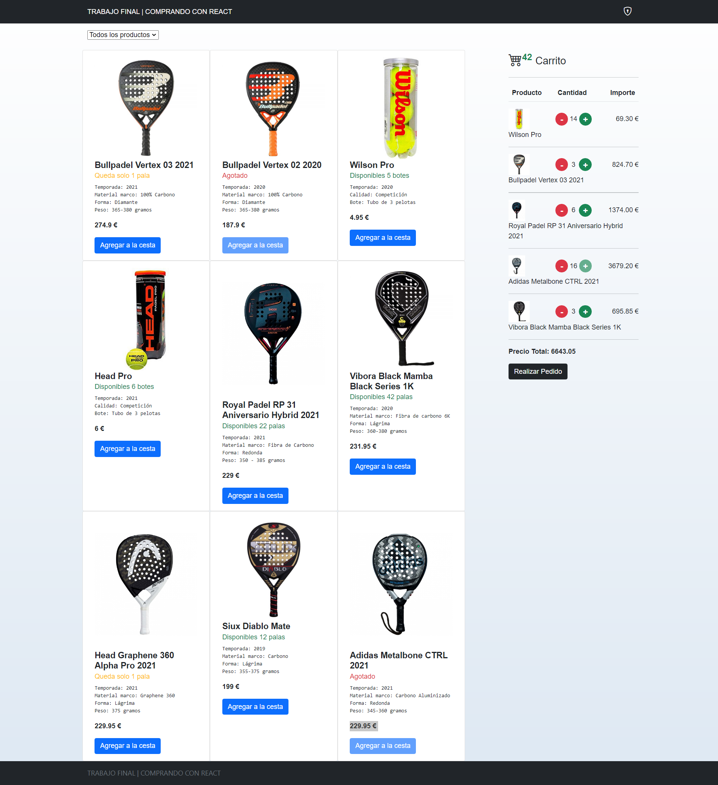

<h1 align="center">Máster Universitario en Desarrollo Ágil de Software para la Web</h1>
<h3 align="center">Carrito de la compra con React</h3>
<h5 align="center">
    Frameworks Frontend - Trabajo Final
</p>
<h6 align="center">
    Universidad de Alcalá
</h6>
<hr>

<!-- ÍNIDICE -->

<details open="open">
  <summary>Índice</summary>
  <ol>
    <li>
      <a href="#about-the-project">El proyecto</a>
      <ul>
        <li><a href="#built-with">Stack</a></li>
      </ul>
    </li>
    <li>
      <a href="#getting-started">Como empezar</a>
      <ul>
        <li><a href="#prerequisites">Requisitos previos</a></li>
        <li><a href="#installation">Instalación</a></li>
      </ul>
    </li>
    <li><a href="#license">Licenciamiento</a></li>
    <li><a href="#contact">Contacto</a></li>
  </ol>
</details>

<!-- EL RPOYECTO -->

## El proyecto



Demo del Proyecto. Desplegado con [Vercel](https://vercel.com/): [Carrito de la compra con React](https://uah-frameworks-frontend-trabajo-final-react.vercel.app/)

Párrafo 1

Lista:
* Contenido 1
* Contenido 2
* Contenido 3

Párrafo 2

Párrafo 3

### Stack

En esta sección se listan las tecnologías, frameworks, librerías y otras herramientas o recursos relevantes usados para la realización del proyecto.

Tecnologías:

* [HTML5](https://html5.org/), [CSS3](https://www.w3.org/TR/CSS/#css), [JavaScript ES6](https://262.ecma-international.org/6.0/)

Framework JS:

* [React 17](https://es.reactjs.org/docs/getting-started.html)

Framework CSS:

* [Bootstrap 5](https://getbootstrap.com/docs/5.0/getting-started/introduction/)

Otros recursos:

* [VSCode](https://code.visualstudio.com/)
* [npm](https://jquery.com)
* [Git](http://git-scm.com/)
* [github](https://github.com/)
* [Markdown](https://jquery.com)

<!-- COMO EMPEZAR -->

## Como empezar

En esta sección se listarán los pasos necesarios para obtener una copia local del proyecto y ejecutarlo en modo desarrollo.

### Requisitos previos

Previamente, debemos tener instalado lo siguiente:

* Un editor de código. Para desarrollo web con React lo más recomendable es usar **VSCode**, al cual se le pueden añadir extensiones específicas para dicho framework, como por ejemplo [ES7 React/Redux/GraphQL/React-Native snippets](https://marketplace.visualstudio.com/items?itemName=dsznajder.es7-react-js-snippets).

* **Node.js**. Es necesario para poder ejecutar código javascript fuera del navegador, con npm como gestor de paquetes y librerías incorporado. Es posible utilizar otros gestores como [yarn](https://yarnpkg.com/).

### Instalación

1. Abrimos un terminal Bash y clonamos el repositorio desde [GitHub](https://github.com/giodimagio/uah-frameworks-frontend-trabajo-final-react), vía HTTPS o SSH.

	HTTPS
   ```sh
   git clone git@github.com:giodimagio/uah-frameworks-frontend-trabajo-final-react
   ```
 	SSH
   ```sh
   git clone https://github.com/giodimagio/uah-frameworks-frontend-trabajo-final-react
   ```
2. Nos movemos a la carpeta del proyecto
   ```sh
   cd uah-frameworks-frontend-trabajo-final-react
   ```
3. Instalamos las dependencias que aparecen en el **package.json** mediante el comando
   ```sh
   npm install
   ```
4. Ejecutamos el siguiente comando para lanzar el servidor de desarrollo de React, por defecto se iniciará en http://localhost:3000/
   ```sh
   npm start
   ```

<!-- LICENCIAMIENTO -->

## Licenciamiento

Distribuido bajo la licencia MIT

<!-- CONTACTO -->

## Contacto

Jorge Romero - [jorge.romeroc@edu.uah.es](mailto:jorge.romeroc@edu.uah.es)